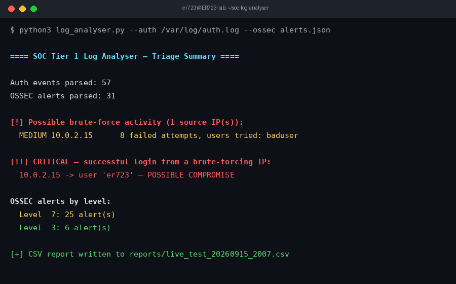

# SOC Log Analyser (Tier 1) — Free & Lightweight

[](https://github.com/ER723/soc-log-analyser/actions/workflows/ci.yml)
[](LICENSE)
[](https://scorecard.dev/viewer/?uri=github.com/ER723/soc-log-analyser)

A single Python file, **zero third-party dependencies**, no database, no
ELK/Splunk. Built to run comfortably on an 8GB RAM Kali VM alongside OSSEC.



*Real output from a live test: a simulated SSH brute force correctly flagged
MEDIUM, then escalated to CRITICAL when the same IP achieved a login — see
[`docs/LIVE_TESTING.md`](docs/LIVE_TESTING.md) for how to reproduce this.*

## Documentation

| Doc | What's in it |
|---|---|
| [`docs/LIVE_TESTING.md`](docs/LIVE_TESTING.md) | Step-by-step procedure to validate detection against a real target (not just the fixtures) |
| [`docs/ESCALATION.md`](docs/ESCALATION.md) | What a Tier 1 analyst does with each severity of flag — validate, contain, escalate |
| [`CONTRIBUTING.md`](CONTRIBUTING.md) | Setup, code style, test, and PR process |
| [`SECURITY.md`](SECURITY.md) | How to report a vulnerability, and what's in scope |
| [`tests/TEST_LOG.md`](tests/TEST_LOG.md) | Running record of live test results |
| [`CHANGELOG.md`](CHANGELOG.md) | Version history |

## Repo layout

```
log_analyser.py                 the tool (stdlib-only)
tests/test_log_analyser.py      unit tests (unittest, stdlib-only)
tests/sample_auth.log           fixture for offline testing
tests/sample_ossec_alerts.json  fixture for offline testing
tests/TEST_LOG.md               running log of live test results
docs/LIVE_TESTING.md            step-by-step live test procedure
docs/ESCALATION.md              Tier 1 -> Tier 2 escalation process
docs/screenshot.png             sample output shown above
docs/incidents/                 per-incident notes (created as needed)
reports/                        generated CSV output (gitignored)
.github/workflows/ci.yml        CI: runs tests + lint on every push
.github/ISSUE_TEMPLATE/         bug report / feature request templates
pyproject.toml                  project manifest (zero runtime deps)
uv.lock                         locked resolution (reproducible dev env)
ruff.toml                       lint config
CONTRIBUTING.md
CHANGELOG.md
LICENSE (MIT)
```

## What it does

- Parses **auth.log / secure** for:
  - Failed password attempts / invalid users
  - Accepted (successful) logins
  - `sudo` command usage
- Parses **OSSEC `alerts.json`** (enable `jsonout_output` in `ossec.conf`)
- **Correlates by source IP**: 5+ failed logins within 10 minutes = flagged
  brute-force. If that same IP later gets a successful login, it's escalated
  to CRITICAL (possible compromise).
- Prints a color-coded terminal triage summary, and can export CSV for
  further review or ticketing.

## Requirements

Python 3.6+ (already on Kali). That's it — no `pip install` needed to run
the tool itself.

## Running tests

Stdlib `unittest`, no test framework dependency:

```bash
python3 -m unittest discover -s tests -v
```

Linting (optional, requires the `dev` extra):
```bash
pip install -e ".[dev]"
ruff check .
```

CI runs both of these on every push (see the badge above).

## One-shot usage

```bash
python3 log_analyser.py --auth /var/log/auth.log --ossec /var/ossec/logs/alerts/alerts.json
```

CSV export:
```bash
python3 log_analyser.py --auth /var/log/auth.log --csv report.csv
```

Auth log only (no OSSEC yet):
```bash
python3 log_analyser.py --auth /var/log/auth.log
```

## Automated / continuous mode

Built-in polling loop (no cron needed, good for a lab demo):
```bash
python3 log_analyser.py --auth /var/log/auth.log --ossec /var/ossec/logs/alerts/alerts.json --watch --interval 60
```

For real "set and forget" automation, use cron instead (lighter than a
long-running Python loop):
```bash
crontab -e
# run every 10 minutes, append CSV report
*/10 * * * * /usr/bin/python3 /path/to/log_analyser.py --auth /var/log/auth.log --ossec /var/ossec/logs/alerts/alerts.json --csv /path/to/reports/report_$(date +\%s).csv >> /path/to/reports/analyser.log 2>&1
```

## Enabling OSSEC JSON alerts (if not already on)

In `/var/ossec/etc/ossec.conf`, inside `<global>`:
```xml
<jsonout_output>yes</jsonout_output>
```
Then restart OSSEC: `sudo /var/ossec/bin/ossec-control restart`
Alerts will appear at `/var/ossec/logs/alerts/alerts.json`.

## Tuning

Edit these two constants near the top of `log_analyser.py`:
```python
BRUTE_FORCE_THRESHOLD = 5     # failed logins to trigger a flag
BRUTE_FORCE_WINDOW_MIN = 10   # time window in minutes
```

## Why this design (Tier 1 relevance)

This mirrors the actual first-pass triage a Tier 1 analyst does before
escalating to Tier 2: identify noisy/repeated auth failures, check whether
an attacker IP ever succeeded (compromise indicator), and cross-reference
against HIDS alerts for anything already scored by OSSEC's rule engine.
It intentionally does NOT try to be a SIEM — no storage, no dashboards,
no agents — just fast, free, disposable triage output.

## Extending it later

- Add web server log parsing (nginx/apache) the same way — one regex block
  + one entry in `run_once()`.
- Swap the CSV writer for a call into your `recon-detector` pipeline if you
  want a single unified alert feed.
- If you outgrow this, the natural free next step is Wazuh (OSSEC's
  actively maintained fork) with its built-in dashboard — still free, just
  heavier than this script.
